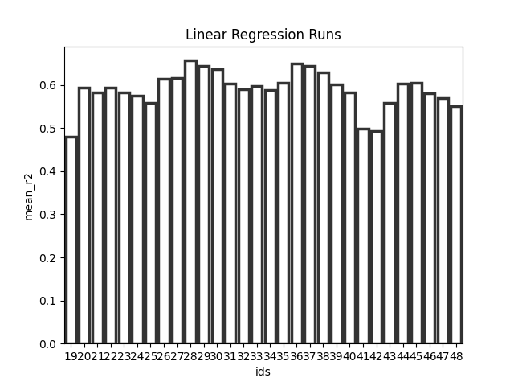

# Assignment 3
author: Lukas Rasocha (lukr@itu.dk)

## Intro and Structure

In this report I will discuss how I used `mlflow` (an open source tool for machine learning lifecycle) to pick the best performing model and set of its hyperparameters to predict a power production based on wind weather data (using `mlflow tracking`). Then I will explain how I used `mlflow projects` to package the code for reusability and reproducability and finally how I deployed the best performing model on a `Azure VM` using `mlflow model`. (you can find a thorough description on how to reproduce the entirity of this github repo in the README).


## Your choice of models and evaluation metrics

The task is to find the best performing regressor trained on historical data, that can predict power production from given weather forecast. The data comes from a static `json` file and contains many features. To train the model I however used only `Wind Speed` and `Wind Direction`. I experimented with two different regressors `Linear Regression` and `K neighbours regressor`.

From the first assignment I know that the relationship between the dependent and independent variable is nonlinear, I therefore first started experimenting with `Linear Regression` and `Polynomial Features`. By running the following command

```
mlflow run . --experiment-name='lukr - Assignment3' -P model_name=lin_reg -P poly_degre=X -P number_of_splits=X
```
Then I put different values for `X`.

For KNN Regressor I ran similar experiments with different hyperparameters
```
mlflow run . --experiment-name='lukr - Assignment3' -P model_name=knn_reg -P number_of_splits=X -P n_neighbours=X -P weights=X
```

In the below figures I plotted all the runs and compared their `mean r^2 score` over the different splits

Linear Regression Runs           |  KNN Regression Runs
:-------------------------:|:-------------------------:
  |  
